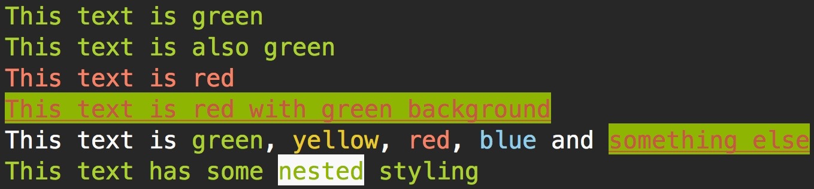

# Chalk
Inspired by [Chalk](https://github.com/chalk/chalk) this is a tool for PHP to style terminal output.

## Installation
<dl>
  <dt>
    Through composer
  </dt>
  <dd>
    Require chalk as a dependency: <code>composer require martin-pettersson/chalk</code>
    <br>
    Include the composer autoload file: <code>require_once 'vendor/autoload.php'</code>
  </dd>
  <dt>
    Manually
  </dt>
  <dd>
    Download/clone the repo
  </dd>
</dl>
Chalk is PSR-4 compliant so any PSR-4 autoloader will do, just add the Chalk namespace "Chalk" and point it to the Chalk/src directory.

## Usage
#### Quick Examples
You can copy this into a .php file and test it out.
```php
<?php

require_once 'vendor/autoload.php';

use Chalk\Chalk;
use Chalk\Style;
use Chalk\Color;
use Chalk\BackgroundColor;

// use the style method to style the text
echo Chalk::style('This text is green', Color::GREEN) . PHP_EOL;

// convenience methods are available for colors (case insensitive)
echo Chalk::green('This text is also green') . PHP_EOL;
echo Chalk::Red('This text is red') . PHP_EOL;

// use a style object to compose styles
$style = new Style([Color::RED, BackgroundColor::GREEN, Style::UNDERLINED]);
echo Chalk::style('This text is red with green background', $style) . PHP_EOL;

// use the parse method for more advanced compositions
echo Chalk::parse('This text is {green}, {yellow}, {red}, {blue} and {something else}', [
  Color::GREEN,
  Color::YELLOW,
  Color::RED,
  Color::BLUE,
  $style
]) . PHP_EOL;

// you can nest styles
// note that the text at the end of the string is still green even after the background styling is reset
echo Chalk::Green('This text has some ' . Chalk::style('nested', BackgroundColor::WHITE) . ' styling') . PHP_EOL;
```
Example output:



#### Methods
**Chalk::style(string $string, mixed $style)**
<br>
Style the string by passing in either a Color/BackgroundColor/Style or a composed style object.

**Chalk::parse(string $string, array $styles)**
<br>
For more advanced styling use the parse method to style specific parts of the string.
Use "{}" tags to target part of the string and pass in an array of styles. The styles matches the index of the found tags.

**Convenience methods**
<br>
If you use `Chalk::{COLOR}($string)` with any available color (case insensitive) it will conveniently map to `Chalk::style($string, {COLOR})`, eg. `Chalk::Red($string) === Chalk::style($string, Color::RED)`

## Available Styles
#### Colors
* Color::**NONE** *(default)*
* Color::**BLACK**
* Color::**RED**
* Color::**GREEN**
* Color::**YELLOW**
* Color::**BLUE**
* Color::**MAGENTA**
* Color::**CYAN**
* Color::**LIGHT_GRAY**
* Color::**DARK_GRAY**
* Color::**LIGHT_RED**
* Color::**LIGHT_GREEN**
* Color::**LIGHT_YELLOW**
* Color::**LIGHT_BLUE**
* Color::**LIGHT_MAGENTA**
* Color::**LIGHT_CYAN**
* Color::**WHITE**

#### Background Colors
* BackgroundColor::**NONE** *(default)*
* BackgroundColor::**BLACK**
* BackgroundColor::**RED**
* BackgroundColor::**GREEN**
* BackgroundColor::**YELLOW**
* BackgroundColor::**BLUE**
* BackgroundColor::**MAGENTA**
* BackgroundColor::**CYAN**
* BackgroundColor::**LIGHT_GRAY**
* BackgroundColor::**DARK_GRAY**
* BackgroundColor::**LIGHT_RED**
* BackgroundColor::**LIGHT_GREEN**
* BackgroundColor::**LIGHT_YELLOW**
* BackgroundColor::**LIGHT_BLUE**
* BackgroundColor::**LIGHT_MAGENTA**
* BackgroundColor::**LIGHT_CYAN**
* BackgroundColor::**WHITE**

#### Styles
* Style::**BOLD**
* Style::**DIM**
* Style::**UNDERLINED**
* Style::**BLINK**
* Style::**INVERTED**
* Style::**HIDDEN**
